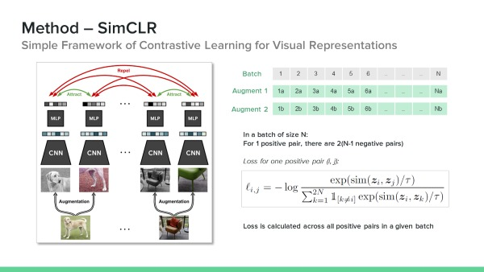
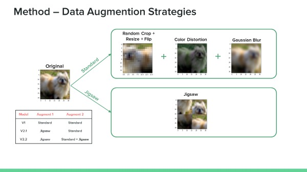
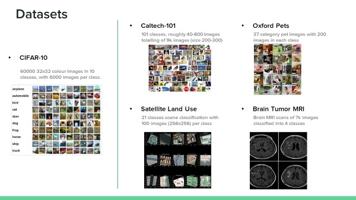
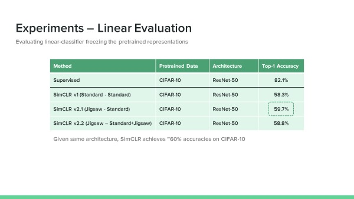
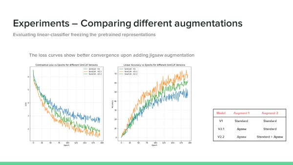
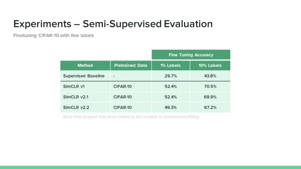
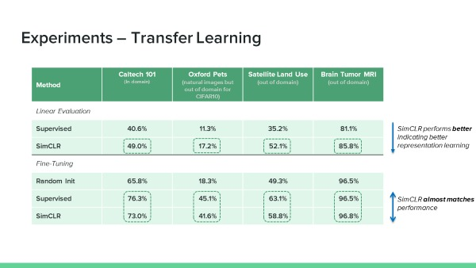
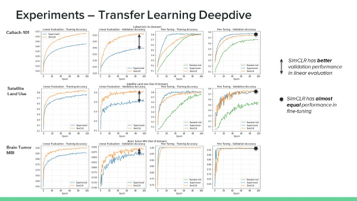
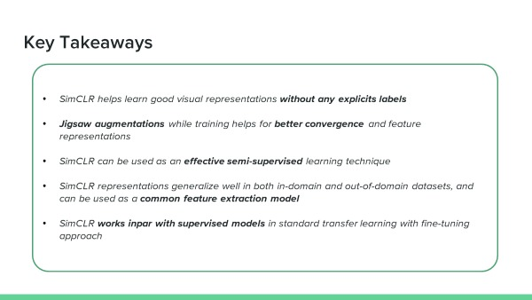

# Self-Supervised Learning for In-Domain and Out-of-Domain Image Classification

The problem with supervised pre-training is the amount of labelled data they need which consumes a lot of manual time. These models also may not fully learn generalized visual representations for all downstream tasks. In this project, we
have implemented a Self-Supervised Learning (SSL) technique called SimCLR, a simple contrastive visual representations learning framework. We showed better convergence under a newly created data augmentation strategy. Few-label scenario
experiments show that SimCLR can be used an effective semi-supervised learning technique. We tested the transfer learning robustness using couple of in-domain and out-of-domain datasets. The results indicate that SimCLR can be used as
common feature extractor for downstream tasks and works on par with supervised pre-trained models in standard fine-tuning scenarios.

## SimCLR

The architecture and training objective of SimCLR:

## New Data Augmentaton
The standard SimCLR model (v1) uses the combination of random crop, random flip, random color distortion, and random Gaussian blur with certain probabilities. Taking inspiration from other pre-text tasks like Jigsaw puzzle representation learning, we have designed a new jigsaw augmentation where 2x2 image patches are randomly shuffled and used for one side of the data augmentation, keeping the other side same as the standard one.

## Datasets
We have used multiple datasets for the purposes of pre-training and transfer learning (both in-domain and out of domain). CIFAR-10 is used for pre-training while others are used for downstream transfer learning.

## Experiments

Self-Supervised Learning can have multiple downstream objectives and hence we evaluate such model in multiple ways.
* **In linear evaluation**, we freeze the entire model and train the final non-linear layer. This is equivalent to doing a logistic regression in the SSL representation space and shows the generalization ability of SimCLR model
* **In few-label evaluation**, we fine-tune the entire model but with few % of sampled images. Here the SSL is used as a semi-supervised learning technique.
* **In transfer learning**, we fine-tune the model on different downstream dataset to understand the ability of SSL to generalize/transfer to different domains. Here, we also perform linear
evaluation.

## Conclusion

